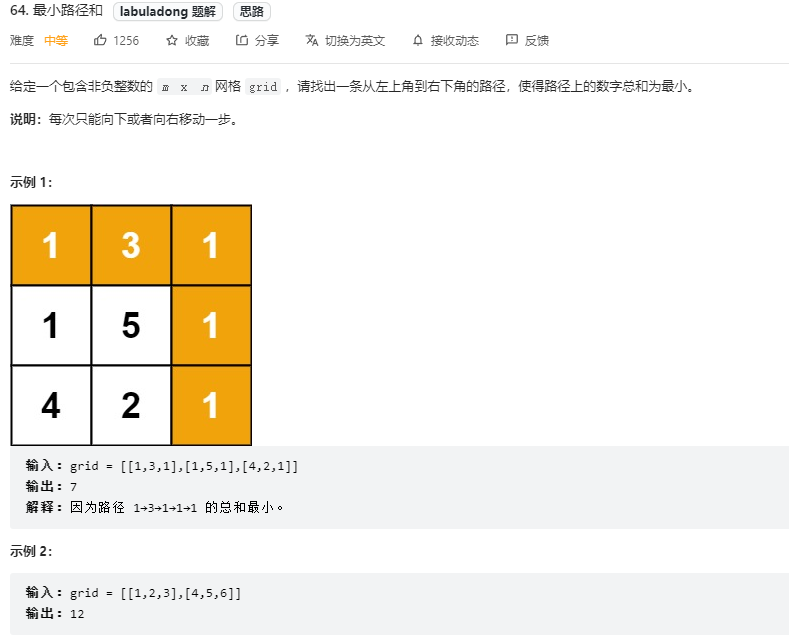
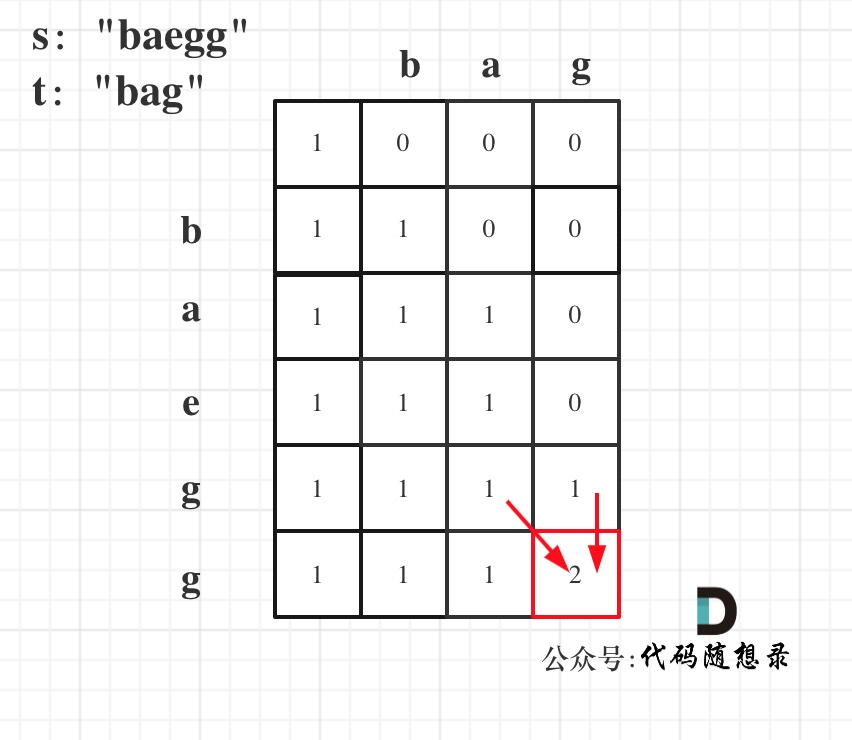
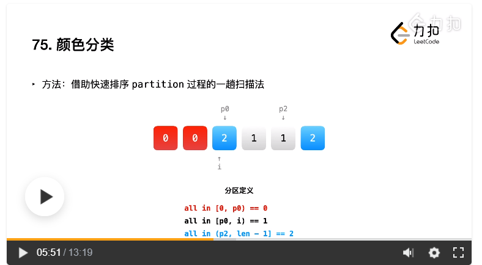

## 英文变量名

进位 carry

虚拟头节点 dummy

上一个 pre

光标游标 cur

面积 area

质数 prime

奇数 odd

偶数 even


## 复习顺序

股票问题 https://leetcode.cn/circle/article/qiAgHn/

链表成环 https://blog.csdn.net/nmsLLCSDN/article/details/123894737

二分法 33 34 81 153 154 https://labuladong.gitee.io/algo/1/10/

深度优先搜索（岛屿问题）

回溯排列、组合、子集 https://labuladong.gitee.io/algo/1/8/

滑动窗口 https://labuladong.gitee.io/algo/1/11/

链表反转


## 排序

### 快排序

最核心的地方

循环不变量（定义不变），初始化保证区间为空

<= pivot [left,j]

pivot (j,right]

```java
public void quickSort(int[] nums, int left,int right){
    if(left>=right) return;
    int pivotIndex = partition(nums, left, right);
    quickSort(nums, left, pivotIndex-1);
    quickSort(nums, pivotIndex+1,right);
    return;
}
// 随机种子为当时时间戳
private final static Random random = new Random(System.currentTimeMillis());

private int partition(int[] nums, int left,int right){
    int randomIndex = left + random.nextInt(right-left+1);
    swap(nums,left,randomIndex);
    int pivot = nums[left];
    //循环不变量（定义不变），初始化保证区间为空
    // <= pivot [left,j]
    // > pivot (j,right]
    int j = left;
    for(int i = left+1; i<=right;i++){
        if(nums[i] <= pivot){
            j++;
            swap(nums,i,j);
        }
    }
    swap(nums, left, j);
    return j;
}

private void swap(int[] nums, int index1,int index2){
    int tmp = nums[index1];
    nums[index1] = nums[index2];
    nums[index2] = tmp;
}
```

### 堆排序

一个数组就可以看作一个完全二叉树，并不需要真的维护一个数，因为索引符号左节点`2*i+1`，右节点`2*i+2`

第一步：把数组变成大顶堆

```java
//构建大顶堆
for (int i = arr.length / 2 - 1; i >= 0; i--) {
    //从第一个非叶子结点从下至上，从右至左调整结构
    adjustHeap(arr, i, arr.length);
}
```

第二部：一个一个把头节点与尾节点交换，维护其他值组成大顶堆

```java
//调整堆结构,交换堆顶元素与末尾元素
for (int j = arr.length - 1; j > 0; j--) {
    //将堆顶元素与末尾元素进行交换
    swap(arr, 0, j);
    //重新对堆进行调整
    adjustHeap(arr, 0, j);
}
```

核心

```java
/**
 * 调整大顶堆
 */
public static void adjustHeap(int[] arr, int i, int length) {
    if (arr == null || arr.length == 0){
        return;
    }

    //先取出当前元素i
    int temp = arr[i];
    //从i结点的左子结点开始，也就是2i+1处开始
    for (int k = i * 2 + 1; k < length; k = k * 2 + 1) {
        //如果左子结点小于右子结点，k指向右子结点
        if (k + 1 < length && arr[k] < arr[k + 1]) {
            k++;
        }
        //如果子节点大于父节点，将子节点值赋给父节点（不用进行交换，已经复制，只需要覆盖）
        if (arr[k] > temp) {
            arr[i] = arr[k];
            i = k;
        } else {
            break;
        }
    }
    //将temp值放到最终的位置
    arr[i] = temp;
}

/**
 * 交换元素
 */
public static void swap(int[] arr, int a, int b) {
    int temp = arr[a];
    arr[a] = arr[b];
    arr[b] = temp;
}
```

## 递归

如果递归函数有返回值，如何区分要搜索一条边，还是搜索整个树呢？

搜索一条边的写法：

```
if (递归函数(root->left)) return ;

if (递归函数(root->right)) return ;
```

搜索整个树写法：

```
left = 递归函数(root->left);
right = 递归函数(root->right);
left与right的逻辑处理;
```

看出区别了没？

**在递归函数有返回值的情况下：如果要搜索一条边，递归函数返回值不为空的时候，立刻返回，如果搜索整个树，直接用一个变量left、right接住返回值，这个left、right后序还有逻辑处理的需要，也就是后序遍历中处理中间节点的逻辑（也是回溯）**。


### 递归三部曲

这里帮助大家确定下来递归算法的三个要素。**每次写递归，都按照这三要素来写，可以保证大家写出正确的递归算法！**

1. **确定递归函数的参数和返回值：** 确定哪些参数是递归的过程中需要处理的，那么就在递归函数里加上这个参数， 并且还要明确每次递归的返回值是什么进而确定递归函数的返回类型。
2. **确定终止条件：** 写完了递归算法, 运行的时候，经常会遇到栈溢出的错误，就是没写终止条件或者终止条件写的不对，操作系统也是用一个栈的结构来保存每一层递归的信息，如果递归没有终止，操作系统的内存栈必然就会溢出。
3. **确定单层递归的逻辑：** 确定每一层递归需要处理的信息。在这里也就会重复调用自己来实现递归的过程。

## 数组

**数组是存放在连续内存空间上的相同类型数据的集合。**

+ **数组下标都是从0开始的。**
+ **数组内存空间的地址是连续的**


### 双指针法

+ 双指针时间复杂度：O(n)O(n)

这道题目迷惑了不少同学，纠结于数组中的元素为什么不能删除，主要是因为以下两点：

+ 数组在内存中是连续的地址空间，不能释放单一元素，如果要释放，就是全释放（程序运行结束，回收内存栈空间）。

双指针法（快慢指针法）在数组和链表的操作中是非常常见的，很多考察数组和链表操作的面试题，都使用双指针法。

### 滑动窗口

+ 滑动窗口时间复杂度：O(n)

本题中，主要要理解滑动窗口如何移动 窗口起始位置，达到动态更新窗口大小的，从而得出长度最小的符合条件的长度。

**滑动窗口的精妙之处在于根据当前子序列和大小的情况，不断调节子序列的起始位置。从而将O(n2)O(n2)的暴力解法降为O(n)。**

如果没有接触过这一类的方法，很难想到类似的解题思路，滑动窗口方法还是很巧妙的。


### 模拟行为

模拟类的题目在数组中很常见，不涉及到什么算法，就是单纯的模拟，十分考察大家对代码的掌控能力。

在这道题目中，我们再一次介绍到了**循环不变量原则**，其实这也是写程序中的重要原则。

相信大家又遇到过这种情况： 感觉题目的边界调节超多，一波接着一波的判断，找边界，踩了东墙补西墙，好不容易运行通过了，代码写的十分冗余，毫无章法，其实**真正解决题目的代码都是简洁的，或者有原则性的**，大家可以在这道题目中体会到这一点。

比如：坚持左闭右开的原则

## 链表

+ 添加虚拟头节点dummyHead，输出一般都为dummyHead.next，也不用担心链表为空的情况；
+ 双指针并不仅仅是两个指针，反正指针是O(1)，怎么方便怎么来，多加几个没问题；
+ 题目中有“倒数第n个”的，可以考虑快慢指针先间隔n，再遍历；
+ 链表是否成环，理解 x = ( n - 1 ) ( y + z ) + z
+ `head.next.next = head`成环，`head.next = null`解环
+ 就是要舍得加指针，做不出来就多加几个，但是不好想


### 成环

慢指针走 x+y

快指针走 x+y+n( y + z ) 

2*慢指针 = 快指针

x = ( n - 1 ) ( y + z ) + z


相遇以后，一个指针回到头节点（路程x），另一个指针继续一步一步走，遇到以后就是环的入口

### 24. 两两交换链表中的节点

虚拟头节点


### 翻转

翻转链表206

```java
// 双指针
class Solution {
    public ListNode reverseList(ListNode head) {
        ListNode prev = null;
        ListNode cur = head;
        ListNode temp = null;
        while (cur != null) {
            temp = cur.next;// 保存下一个节点
            cur.next = prev;
            prev = cur;
            cur = temp;
        }
        return prev;
    }
}
```

[92. 反转链表 II](https://leetcode.cn/problems/reverse-linked-list-ii/)

```java
public ListNode reverseBetween(ListNode head, int left, int right) {
    if(left == right) return head;
    // 虚拟头节点
    ListNode virhead = new ListNode(-1, head);
    for(int i=0; i<left-1;i++){
        virhead = virhead.next;
    }
    ListNode pre = virhead;
    ListNode cur = virhead.next;
    ListNode tmp = null;
    for(int i=left;i<=right;i++){
        tmp = cur.next;
        cur.next = pre;
        pre = cur;
        cur = tmp;
    }
    virhead.next.next = cur;
    virhead.next = pre;
    // 这里很重要
    if(left == 1) return virhead.next;
    return head;
}
```


### 143. 重排链表

寻找链表中点 + 链表逆序 + 合并链表

快慢指针找到中点

后半段逆序，再合并


## 哈希表

+ int[] nums = new int[26]; 就是最简单的哈希，真哈希表。
+ 剪枝是去重，或者提高性能的方法  if (i > k + 1 && nums[i] == nums[i - 1]) continue;
+ Set<Integer> sum = new HashSet<>(); 哈希Set集合，无重复
+ List<String> result = new ArrayList<>(); List集合，有重复
+ Map<Integer, Integer> map = new HashMap<>(); Map集合是一种双列集合，每个元素包含两个值。
+ List<List<Integer>> result = new ArrayList<>(); result.add(Arrays.asList(nums[i], nums[left], nums[right]));


###  1002. 查找常用字符


```java
for (int k = 0; k < 26; k++) {
    hash[k] = Math.min(hash[k], hashOtherStr[k]);
}
```

最重要的就是这个min


## 字符串

+ String用toCharArray() 方法变数组，就可以用增强型for循环了，省很多事情
+ StringBuilder 的 append()方法很常用
+ 正则匹配连续的空白字符作为分隔符分割 List<String> wordList = Arrays.asList(s.split("\\s+"));
+ 把字符串分隔成数组 String[] strArray = s.split(" ");
+ StringBuffer setCharAt 是用来替换的，方法里面有两个参数 setCharAt(int index,Char ch),第一个参数是取代的位置 索引从0开始 第二个参数是你要替换为的字符串；


### KMP

next数组前后缀意思是顺序相同，不是镜像，isisp最大公共前后缀为2，issip最大公共前后缀为1


## 栈和队列

Deque

|            | 队列  |             | 栈   |                            |
| ---------- | ----- | ----------- | ---- | -------------------------- |
| 增         | offer | addLast     | push | addFirst                   |
| 弹出头元素 | poll  | pollFirst() | pop  | removeFirst()，pollFirst() |
| 显示头元素 | peek  | peekFirst() | peek | peekFirst()                |

队和栈只在元素加入时不一样，其他都是对头进行操作，不影响，以后习惯加First和Last

## 二叉树

**二叉树题目的递归解法可以分两类思路，第一类是遍历一遍二叉树得出答案，第二类是通过分解问题计算出答案，这两类思路分别对应着 [回溯算法核心框架](https://labuladong.gitee.io/algo/4/29/103/) 和 [动态规划核心框架](https://labuladong.gitee.io/algo/3/23/66/)**。


+ 深度和高度

高度后序遍历

深度

前序遍历


### 前中后遍历

#### 递归

```java
void inorder(TreeNode root, List<Integer> list) {
    if (root == null) return;//停止条件
    inorder(root.left, list);//左 root.left
    list.add(root.val);//中 用root进行各种操作
    inorder(root.right, list);//右 root.right
}
```

#### 迭代

中序遍历

```java
public List<Integer> inorderTraversal(TreeNode root) {
    List<Integer> res = new ArrayList<>();
    if(root==null) return res;

    Deque<TreeNode> stack = new LinkedList<>();
    TreeNode cur = root;
    while (cur != null || !stack.isEmpty()){
        if(cur!= null){
            stack.push(cur);
            cur = cur.left; // 左
        }else {
            cur = stack.pop();// 向上找父节点，中
            res.add(cur.val); // 输出中间结点
            cur = cur.right; //指向右节点
        }
    }
    return res;
}
```

前序遍历

中--右--左进栈，左--右--中出栈

```java
public List<Integer> preorderTraversal(TreeNode root) {
    List<Integer> res = new ArrayList<>();
    if(root==null) return res;

    Deque<TreeNode> stack = new LinkedList<>();
    stack.push(root);
    while (!stack.isEmpty()){
        TreeNode node = stack.pop();
        res.add(node.val);
        if(node.right != null) stack.push(node.right);
        if(node.left != null) stack.push(node.left);
    }
    return res;
}
```

后序遍历

中--左--右进栈，右--左--中出栈，再翻转为

```java
public List<Integer> postorderTraversal(TreeNode root) {
    List<Integer> res = new ArrayList<>();
    if(root==null) return res;

    Deque<TreeNode> stack = new LinkedList<>();
    stack.push(root);
    while (!stack.isEmpty()){
        TreeNode node = stack.pop();
        res.add(node.val);
        if (node.left != null) stack.push(node.left); //左
        if (node.right != null) stack.push(node.right);//右
    }
    Collections.reverse(res);
    return res;
}
```


### 层序遍历

```java

```


```java

```


回溯

对称二叉树、平衡二叉树

## 回溯

**其核心就是 for 循环里面的递归，在递归调用之前「做选择」，在递归调用之后「撤销选择」**

### 注意

+ 需要有序
+ 


```java
public void pathRes(TreeNode root, int targetSum) {
    if (root == null) return;
    //1.添加节点
    deque.addLast(root.val);
    
    //2.算法实现过程
    。。。
    
    //3.进入下一层
    pathRes(root.left, targetSum - root.val);
    pathRes(root.right, targetSum - root.val);
    
    //4.回溯本层节点
    //回溯每个点都要回溯，不要跳过回溯否则平添麻烦
    deque.pollLast();
}
```

### 回溯三部曲

+ **递归函数参数**
+ **递归终止条件**
  + 添加结果

+ **单层搜索的逻辑**
  + 递归
  + 回溯
+ 剪枝

```java
List<List<Integer>> result = new ArrayList<>();
LinkedList<Integer> path = new LinkedList<>();
public List<List<Integer>> combine(int n, int k) {
    combineHelper(n, k, 1);
    return result;
}

/**
     * 每次从集合中选取元素，可选择的范围随着选择的进行而收缩，调整可选择的范围，就是要靠startIndex
     * @param startIndex 用来记录本层递归的中，集合从哪里开始遍历（集合就是[1,...,n] ）。
     */
private void combineHelper(int n, int k, int startIndex){
    //终止条件
    if (path.size() == k){
        result.add(new ArrayList<>(path));
        return;
    }
    for (int i = startIndex; i <= n; i++){
        path.add(i);
        combineHelper(n, k, i + 1);
        path.removeLast();
    }
}
```

```java
//剪枝
for (int i = startIndex; i <= n - (k - path.size()) + 1; i++){
```

|      | 无重复 不可复选                                      | 元素可重复                                                   | 元素可复选                 |
| ---- | ---------------------------------------------------- | ------------------------------------------------------------ | -------------------------- |
| 子集 | 保存所有中间路径                                     | 需要先进行排序，让相同的元素靠在一起，如果发现 `nums[i] == nums[i-1]`，则跳过 | backtrack(nums, i, target) |
| 组合 | 保存叶子节点路径                                     | 需要先进行排序，让相同的元素靠在一起，如果发现 `nums[i] == nums[i-1]`，则跳过 | backtrack(nums, i, target) |
| 排列 | 需要额外使用 `used` 数组来标记哪些元素还可以被选择。 | 新添加的剪枝逻辑，固定相同的元素在排列中的相对位置           |                            |


可重复：子集和排列这种需要进行去重

可复选：每次分支要包含自身


### 子集（元素无重不可复选）78 题「 [子集](https://leetcode.cn/problems/subsets/)」

保存所有中间路径

### 组合（元素无重不可复选）77 题「 [组合](https://leetcode.cn/problems/combinations/)」

不可复选`backtrack(nums, i + 1, target);`

保存叶子节点路径

### 排列（元素无重不可复选）46 题「 [全排列](https://leetcode.cn/problems/permutations/)」

**需要额外使用 `used` 数组来标记哪些元素还可以被选择**。

每次都从头到尾for循环

`for(int i=0; i<nums.length;i++)`


### 子集/组合（元素可重不可复选）90 题「 [子集 II](https://leetcode.cn/problems/subsets-ii/)」

**需要先进行排序，让相同的元素靠在一起，如果发现 `nums[i] == nums[i-1]`，则跳过**

可复选`backtrack(nums, i, target);`


### 排列（元素可重不可复选）47 题「 [全排列 II](https://leetcode.cn/problems/permutations-ii/)」

`// 新添加的剪枝逻辑，固定相同的元素在排列中的相对位置`

​      `if (i > 0 && nums[i] == nums[i - 1] && !used[i - 1]) {`

​        `continue;`

​      `}`

### 子集/组合（元素无重可复选）39 题「 [组合总和](https://leetcode.cn/problems/combination-sum/)」


### 排列（元素无重可复选）


### 总结

+ 可复选`backtrack(nums, i, target);`
+ 不可复选`backtrack(nums, i + 1, target);`
+ 排列used数组 + `for(int i=0; i<nums.length;i++)`
+ 子集保存中间路径
+ 元素可重剪枝`if (i > start && nums[i] == nums[i - 1])`
+ 元素可重+排列`if (i > 0 && nums[i] == nums[i - 1] && !used[i - 1])`


## 贪心算法

经验算法

从局部最优解获取全局最优解，只适合部分题，不能解决局部最优解和全局最优解冲突的情况

406题的逻辑写得太好了

选择左边界排序，还是右边界排序是个问题

### 数组排序方法

对数组进行排序

```java
// 身高从大到小排（身高相同k小的站前面）
Arrays.sort(people, (a, b) -> {
    if (a[0] == b[0]) return a[1] - b[1];
    return b[0] - a[0];
});
//Lambda表达式为Comparator接口进行实例化，自定义排序规则
//        public static <T> void sort(T[] a, Comparator<? super T> c) {
//            if (c == null) {
//                sort(a);
//            } else {
//                if (Arrays.LegacyMergeSort.userRequested)
//                    legacyMergeSort(a, c);
//                else
//                    TimSort.sort(a, 0, a.length, c, null, 0, 0);
//            }
//        }

//        降序排列：obj1-obj2>0的话返回-1，说明按照从大到小排序b-a
//        升序排列：obj1-obj2>0的话返回1，说明按照从小到大排序a-b
```

为了防止int溢出，比如这个数据{{-2147483646,-2147483645},{2147483646,2147483647}}

```java
// 身高从大到小排（身高相同k小的站前面）
// 写的排序语句，不要超过了int的范围
Arrays.sort(points, (a, b) -> {
    if (a[0] == b[0]) {
        if(a[1] >= b[1]) return 1;
        else return -1;
    }
    else if(a[0] > b[0]) return 1;
    else return -1;
});
```

简单排序

```java
Arrays.sort(points, (o1, o2) -> Integer.compare(o1[0], o2[0]));
```

```java
//右边界排序，升序
Arrays.sort(intervals, (a, b) -> {
    if (a[1] == b[1]) {
        return Integer.compare(a[0],b[0]);
    }
    return Integer.compare(a[1],b[1]);
});
```

## 动态规划

前置技术：暴力+备忘录

空间换时间

动态规划，英文：Dynamic Programming，简称DP，如果某一问题有很多重叠子问题，使用动态规划是最有效的。

动态规划中dp[j]是由dp[j-weight[i]]推导出来的，然后取max(dp[j], dp[j - weight[i]] + value[i])。

### 动态规划的解题步骤

做动规题目的时候，很多同学会陷入一个误区，就是以为把状态转移公式背下来，照葫芦画瓢改改，就开始写代码，甚至把题目AC之后，都不太清楚dp[i]表示的是什么。

**这就是一种朦胧的状态，然后就把题给过了，遇到稍稍难一点的，可能直接就不会了，然后看题解，然后继续照葫芦画瓢陷入这种恶性循环中**。

状态转移公式（递推公式）是很重要，但动规不仅仅只有递推公式。

**对于动态规划问题，我将拆解为如下五步曲，这五步都搞清楚了，才能说把动态规划真的掌握了！**

1. 确定dp数组（dp table）以及下标的含义
2. 确定递推公式
3. dp数组如何初始化
4. 确定遍历顺序（从前向后或两个for循环的顺序）
5. 举例推导dp数组（打印dp数组）

一些同学可能想为什么要先确定递推公式，然后在考虑初始化呢？


### 最优子结构

这个问题是动态规划问题，因为它具有「最优子结构」的。**要符合「最优子结构」，子问题间必须互相独立**。啥叫相互独立？你肯定不想看数学证明，我用一个直观的例子来讲解。

比如说，假设你考试，每门科目的成绩都是互相独立的。你的原问题是考出最高的总成绩，那么你的子问题就是要把语文考到最高，数学考到最高…… 为了每门课考到最高，你要把每门课相应的选择题分数拿到最高，填空题分数拿到最高…… 当然，最终就是你每门课都是满分，这就是最高的总成绩。

得到了正确的结果：最高的总成绩就是总分。因为这个过程符合最优子结构，「每门科目考到最高」这些子问题是互相独立，互不干扰的。

但是，如果加一个条件：你的语文成绩和数学成绩会互相制约，不能同时达到满分，数学分数高，语文分数就会降低，反之亦然。

这样的话，显然你能考到的最高总成绩就达不到总分了，按刚才那个思路就会得到错误的结果。因为「每门科目考到最高」的子问题并不独立，语文数学成绩户互相影响，无法同时最优，所以最优子结构被破坏。

回到凑零钱问题，为什么说它符合最优子结构呢？假设你有面值为 `1, 2, 5` 的硬币，你想求 `amount = 11` 时的最少硬币数（原问题），如果你知道凑出 `amount = 10, 9, 6` 的最少硬币数（子问题），你只需要把子问题的答案加一（再选一枚面值为 `1, 2, 5` 的硬币），求个最小值，就是原问题的答案。因为硬币的数量是没有限制的，所以子问题之间没有相互制，是互相独立的。


### LT_64题

这道题是一个非常抽象（动态规划的核心思想）的动态规划题目



```java
public class Solution {
    public static int minPathSum(int[][] grid) {
        int m = grid.length;
        int n = grid[0].length;
        int[][] dp = new int[m][n];
        //初始化
        dp[0][0] = grid[0][0];
        for (int i = 1; i < n; i++) {
            dp[0][i] = grid[0][i] + dp[0][i - 1];
        }
        for (int i = 1; i < m; i++) {
            dp[i][0] = grid[i][0] + dp[i - 1][0];
        }

        for (int i = 1; i < m; i++) {
            for (int j = 1; j < n; j++) {
                dp[i][j] = Math.min(dp[i][j - 1], dp[i - 1][j]) + grid[i][j];
            }
        }
        return dp[m - 1][n - 1];
    }

    public static void main(String[] args) {
        int[][] nums = {{1, 3, 1}, {1, 5, 1}, {4, 2, 1}};
        System.out.println(Solution.minPathSum(nums));
    }
}
```

1. 确定dp数组（dp table）以及下标的含义：最小路径和
2. 确定递推公式：`dp[i][j] = Math.min(dp[i][j - 1], dp[i - 1][j]) + grid[i][j]`
3. dp数组如何初始化：相加
4. 确定遍历顺序（从前向后或两个for循环的顺序）：顺序遍历
5. 举例推导dp数组（打印dp数组）：


### 基础题

+ 斐波那契，爬楼梯，不同路径

都是非常明显的递推公式


+ 有障碍的不同路径

只需要注意特殊情况


### 背包问题

#### 01背包

01背包中，dp[j] 表示： 容量为j的背包，所背的物品价值可以最大为dp[j]。

01背包的递推公式：dp[j] = max(dp[j], dp[j - weight[i]] + value[i]);

1. 确定dp数组含义和容量
2. 确定weigh和value


##### 二维数组

遍历顺序正序

先遍历物品还是先遍历背包都一样

##### 滚动数组

先遍历物品

再遍历背包，且倒叙（为了让物品只添加一次，物品唯一不能添加两次，因为一维数组是重复利用，所以要保证本层新添加的数据，不能对本层下一个数据造成影响，二维数组没有这方面麻烦）

#### 完全背包

##### 遍历顺序

**如果求组合数就是外层for循环遍历物品，内层for遍历背包**。

**如果求排列数就是外层for遍历背包，内层for循环遍历物品**。

```
// 组合
for (int i = 0; i < coins.length; i++) {
    for (int j = coins[i]; j <= amount; j++) {
    	状态转移公式;
    }
}

// 排列
for (int i = 0; i <= n; i++) {
    for (int j = 0; j < weight.length; j++) {
    	if (i >= weight[j]) 状态转移公式;
    }
}
```

#### 经验

找零钱：看是求组合数，还是价值数

求组合或排列数量：dp[i] += dp[i - nums[j]];

普通背包：dp[j] = max(dp[j], dp[j - weight[i]] + value[i]);

变爬楼梯：完全背包的排列问题

完全平方数：求最少数量，value是1，weight是i*i

求最少数量：value是1，不分组合或排列

## 打家劫舍

### 普通打家劫舍

不能盗取相邻

当房子有n间时：
当要求盗取第n间的最大获利时，前面我们已经算出了盗取至n-1和n-2的最大获利。那么此时有两种情况：

盗取第n间。就只能获得前面至n-2间的最大获利，因为相邻的n-1不能盗取,最终获利为：dp[n-2]+nums[n]

不盗取第n间。那么最大获利就是，前面算出的至前上一间房子为止的最大获利：dp[n-1]

盗取n间的最大获利为：`dp[n]=max(dp[n-2]+nums[n],dp[n-1])`

### 成环

分为两种情况，考虑范围分别为:(0,n-1)与(1,n)

### 二叉树

s1表示偷根节点所在的那一层和不和它相邻的层，s0表示偷和根节点相邻的那一层，然后我们用动态规划的思想就可以解决这个问题了。

```java
class Solution {
    public int rob(TreeNode root) {
        if(root == null)
            return 0;
        int s0 = 0;
        int s1 = root.val;        
        s0 = rob(root.left) + rob(root.right);     
        if(root.left != null)
            s1 += rob(root.left.left) + rob(root.left.right);
        if(root.right != null)
            s1 += rob(root.right.left) + rob(root.right.right);
        return Math.max(s0,s1);
    }
}
```


## 股票问题

`T[i][k][0]` 表示在第 i 天结束时，最多进行 k 次交易且在进行操作后持有 0 份股票的情况下可以获得的最大收益；
`T[i][k][1]` 表示在第 i 天结束时，最多进行 k 次交易且在进行操作后持有 1 份股票的情况下可以获得的最大收益。

```java
if (prices == null || prices.length == 0) {
    return 0;
}
int length = prices.length;
int[][] dp = new int[length][2];
dp[0][0] = 0;
dp[0][1] = -prices[0];

```


### 情况一：k = 1

```java
dp[i][0] = Math.max(dp[i - 1][0], dp[i - 1][1] + prices[i]);
dp[i][1] = Math.max(dp[i - 1][1], -prices[i]);
```


### 情况二：k 为正无穷

```java
dp[i][0] = Math.max(dp[i - 1][0], dp[i - 1][1] + prices[i]);
dp[i][1] = Math.max(dp[i - 1][1], dp[i - 1][0] - prices[i]);
```


### 情况三：k = 2

```java
dp[i][2][0] = Math.max(dp[i - 1][2][0], dp[i - 1][2][1] + prices[i]);
dp[i][2][1] = Math.max(dp[i - 1][2][1], dp[i - 1][1][0] - prices[i]);
dp[i][1][0] = Math.max(dp[i - 1][1][0], dp[i - 1][1][1] + prices[i]);
dp[i][1][1] = Math.max(dp[i - 1][1][1], dp[i - 1][0][0] - prices[i]);
```


### 情况四：k 为任意值

一个有收益的交易至少需要两天，当k >= length / 2 就变成k 为正无穷问题

```java
for (int i = 1; i <= k; i++) {
    dp[0][i][0] = 0;
    dp[0][i][1] = -prices[0];
}
for (int i = 1; i < length; i++) {
    for (int j = k; j > 0; j--) {
        dp[i][j][0] = Math.max(dp[i - 1][j][0], dp[i - 1][j][1] + prices[i]);
        dp[i][j][1] = Math.max(dp[i - 1][j][1], dp[i - 1][j - 1][0] - prices[i]);
    }
}

```


### 情况五：k 为正无穷但有冷却时间

情况五和情况二非常相似，不同之处在于情况五有「冷却时间」的限制，因此需要对状态转移方程进行一些修改。

```java
dp[i][0] = Math.max(dp[i - 1][0], dp[i - 1][1] + prices[i]);
dp[i][1] = Math.max(dp[i - 1][1], (i >= 2 ? dp[i - 2][0] : 0) - prices[i]);
```


### 情况六：k 为正无穷但有手续费

第一种表示方法，在每次买入股票时扣除手续费：

```java
dp[i][0] = Math.max(dp[i - 1][0], dp[i - 1][1] + prices[i]);
dp[i][1] = Math.max(dp[i - 1][1], dp[i - 1][0] - prices[i] - fee);
```

第二种表示方法，在每次卖出股票时扣除手续费：

```java
dp[i][0] = Math.max(dp[i - 1][0], dp[i - 1][1] + prices[i] - fee);
dp[i][1] = Math.max(dp[i - 1][1], dp[i - 1][0] - prices[i]);
```


### 口述

0代表收益

1代表买入

0使用之前成本与本次收入，与之前收益进行比较

1使用之前收益加本次买入，与之前买入进行成本比较


## 子序列问题

### 300.最长递增子序列：

**dp[i]表示i之前包括i的以nums[i]结尾最长上升子序列的长度**

if (nums[i] > nums[j]) dp[i] = max(dp[i], dp[j] + 1);


### 674. 最长连续递增序列

**dp[i]：以下标i为结尾的数组的连续递增的子序列长度为dp[i]**。

和上面不同，i只取决于i-1，不需要遍历前面所有，所以只有一层循环

```java
if (nums[i + 1] > nums[i]) {
    dp[i + 1] = dp[i] + 1;
}
```


### 718. 最长重复子数组

`dp[i][j] ：以下标i - 1为结尾的A，和以下标j - 1为结尾的B，最长重复子数组长度为dp[i][j]。`

`根据dp[i][j]的定义，dp[i][j]的状态只能由dp[i - 1][j - 1]推导出来。`

`即当A[i - 1] 和B[j - 1]相等的时候，dp[i][j] = dp[i - 1][j - 1] + 1;`

滚动数组还是需要避免前向影响，第二个循环需要倒序

```java
// 普通
// 这里的i-1是因为dp的索引加了1
if (nums1[i - 1] == nums2[j - 1]) {
    dp[i][j] = dp[i - 1][j - 1] + 1;
}

// 滚动数组
if (nums1[i - 1] == nums2[j - 1]) {
    dp[j] = dp[j - 1] + 1;
} else {
    // 注意这里要赋0
    dp[j] = 0;
}
```


### 1143.最长公共子序列

和上面不同的是不需要连续

三个方向影响

如果text1[i - 1] 与 text2[j - 1]相同，那么找到了一个公共元素，所以dp[i][j] = dp[i - 1][j - 1] + 1;

如果text1[i - 1] 与 text2[j - 1]不相同，那就看看text1[0, i - 2]与text2[0, j - 1]的最长公共子序列 和 text1[0, i - 1]与text2[0, j - 2]的最长公共子序列，取最大的。

```java
if (text1[i - 1] == text2[j - 1]) {
    dp[i][j] = dp[i - 1][j - 1] + 1;
} else {
    dp[i][j] = max(dp[i - 1][j], dp[i][j - 1]);
}
```

不能滚动是因为还受前面的影响，不能倒序


### 1035.不相交的线

**本题说是求绘制的最大连线数，其实就是求两个字符串的最长公共子序列的长度！**


### 53. 最大子序和

**dp[i]：包括下标i之前的最大连续子序列和为dp[i]**。

dp[i]只有两个方向可以推出来：

- dp[i - 1] + nums[i]，即：nums[i]加入当前连续子序列和
- nums[i]，即：从头开始计算当前连续子序列和

一定是取最大的，所以dp[i] = max(dp[i - 1] + nums[i], nums[i]);

```java
dp[i] = Math.max(dp[i - 1] + nums[i], nums[i]);
```


### 392.判断子序列

和1143的区别是单向看是否属于，

`从递推公式可以看出dp[i][j]都是依赖于dp[i - 1][j - 1] 和 dp[i][j - 1]，所以dp[0][0]和dp[i][0]是一定要初始化的。`

```java
class Solution {
    public boolean isSubsequence(String s, String t) {
        int length1 = s.length(); int length2 = t.length();
        int[][] dp = new int[length1+1][length2+1];
        for(int i = 1; i <= length1; i++){
            for(int j = 1; j <= length2; j++){
                if(s.charAt(i-1) == t.charAt(j-1)){
                    dp[i][j] = dp[i-1][j-1] + 1;
                }else{
                    dp[i][j] = dp[i][j-1];
                }
            }
        }
        if(dp[length1][length2] == length1){
            return true;
        }else{
            return false;
        }
    }
}
```


### 115.不同的子序列

给定一个字符串 s 和一个字符串 t ，计算在 s 的子序列中 t 出现的个数。

求次数，不是求个数也不是求是否存在

这一类问题，基本是要分析两种情况

- s[i - 1] 与 t[j - 1]相等
- s[i - 1] 与 t[j - 1] 不相等



初始化

`dp[i][0] 表示：以i-1为结尾的s可以随便删除元素，出现空字符串的个数。`

`那么dp[i][0]一定都是1，因为也就是把以i-1为结尾的s，删除所有元素，出现空字符串的个数就是1。`

```java
if (s[i - 1] == t[j - 1]) {
    dp[i][j] = dp[i - 1][j - 1] + dp[i - 1][j];
} else {
    dp[i][j] = dp[i - 1][j];
}
```


###  583. 两个字符串的删除操作

- 当word1[i - 1] 与 word2[j - 1]相同的时候
- 当word1[i - 1] 与 word2[j - 1]不相同的时候

当word1[i - 1] 与 word2[j - 1]相同的时候，dp[i][j] = dp[i - 1][j - 1];

当word1[i - 1] 与 word2[j - 1]不相同的时候，有三种情况：

情况一：删word1[i - 1]，最少操作次数为dp[i - 1][j] + 1

情况二：删word2[j - 1]，最少操作次数为dp[i][j - 1] + 1

情况三：同时删word1[i - 1]和word2[j - 1]，操作的最少次数为dp[i - 1][j - 1] + 2

那最后当然是取最小值，所以当word1[i - 1] 与 word2[j - 1]不相同的时候，递推公式：dp[i][j] = min({dp[i - 1][j - 1] + 2, dp[i - 1][j] + 1, dp[i][j - 1] + 1});

dp[i][0]：word2为空字符串，以i-1为结尾的字符串word1要删除多少个元素，才能和word2相同呢，很明显dp[i][0] = i。


本题和[动态规划：1143.最长公共子序列](https://gitee.com/link?target=https%3A%2F%2Fprogrammercarl.com%2F1143.%E6%9C%80%E9%95%BF%E5%85%AC%E5%85%B1%E5%AD%90%E5%BA%8F%E5%88%97.html)基本相同，只要求出两个字符串的最长公共子序列长度即可，那么除了最长公共子序列之外的字符都是必须删除的，最后用两个字符串的总长度减去两个最长公共子序列的长度就是删除的最少步数。


```java
class Solution {
    public int minDistance(String word1, String word2) {
        int[][] dp = new int[word1.length() + 1][word2.length() + 1];
        for (int i = 0; i < word1.length() + 1; i++) dp[i][0] = i;
        for (int j = 0; j < word2.length() + 1; j++) dp[0][j] = j;
        
        for (int i = 1; i < word1.length() + 1; i++) {
            for (int j = 1; j < word2.length() + 1; j++) {
                if (word1.charAt(i - 1) == word2.charAt(j - 1)) {
                    dp[i][j] = dp[i - 1][j - 1];
                }else{
                    dp[i][j] = Math.min(dp[i - 1][j - 1] + 2,
                                        Math.min(dp[i - 1][j] + 1, dp[i][j - 1] + 1));
                }
            }
        }
        
        return dp[word1.length()][word2.length()];
    }
}
```


###  72. 编辑距离

```java
if (word1[i - 1] == word2[j - 1])
    不操作
if (word1[i - 1] != word2[j - 1])
    增
    删
    换
```

**word2添加一个元素，相当于word1删除一个元素**

替换元素 即 `dp[i][j] = dp[i - 1][j - 1] + 1;`

```java
if (word1[i - 1] == word2[j - 1]) {
    dp[i][j] = dp[i - 1][j - 1];
}
else {
    dp[i][j] = min({dp[i - 1][j - 1], dp[i - 1][j], dp[i][j - 1]}) + 1;
}
```

```java
public int minDistance(String word1, String word2) {
    int m = word1.length();
    int n = word2.length();
    int[][] dp = new int[m + 1][n + 1];
    // 初始化
    for (int i = 1; i <= m; i++) {
        dp[i][0] =  i;
    }
    for (int j = 1; j <= n; j++) {
        dp[0][j] = j;
    }
    for (int i = 1; i <= m; i++) {
        for (int j = 1; j <= n; j++) {
            // 因为dp数组有效位从1开始
            // 所以当前遍历到的字符串的位置为i-1 | j-1
            if (word1.charAt(i - 1) == word2.charAt(j - 1)) {
                dp[i][j] = dp[i - 1][j - 1];
            } else {
                dp[i][j] = Math.min(Math.min(dp[i - 1][j - 1], dp[i][j - 1]), dp[i - 1][j]) + 1;
            }
        }
    }
    return dp[m][n];
}
```

###  

### 647. 回文子串

双指针中心扩散法

```java
result += extend(s, i, i, s.length()); // 以i为中心
result += extend(s, i, i + 1, s.length()); // 以i和i+1为中心
```

动态规划

布尔类型的dp[i][j]：表示区间范围[i,j] （注意是左闭右闭）的子串是否是回文子串，如果是dp[i][j]为true，否则为false。

当s[i]与s[j]不相等，那没啥好说的了，dp[i][j]一定是false。

当s[i]与s[j]相等时，这就复杂一些了，有如下三种情况

- 情况一：下标i 与 j相同，同一个字符例如a，当然是回文子串
- 情况二：下标i 与 j相差为1，例如aa，也是回文子串
- 情况三：下标：i 与 j相差大于1的时候，例如cabac，此时s[i]与s[j]已经相同了，我们看i到j区间是不是回文子串就看aba是不是回文就可以了，那么aba的区间就是 i+1 与 j-1区间，这个区间是不是回文就看dp[i + 1][j - 1]是否为true。

```
if (s[i] == s[j]) {
    if (j - i <= 1) { // 情况一 和 情况二
        result++;
        dp[i][j] = true;
    } else if (dp[i + 1][j - 1]) { // 情况三
        result++;
        dp[i][j] = true;
    }
}
```


所以竖着遍历

```java
class Solution {
    public int countSubstrings(String s) {
        int len, ans = 0;
        if (s == null || (len = s.length()) < 1) return 0;
        //dp[i][j]：s字符串下标i到下标j的字串是否是一个回文串，即s[i, j]
        boolean[][] dp = new boolean[len][len];
        for (int j = 0; j < len; j++) {
            for (int i = 0; i <= j; i++) {
                //当两端字母一样时，才可以两端收缩进一步判断
                if (s.charAt(i) == s.charAt(j)) {
                    //i++，j--，即两端收缩之后i,j指针指向同一个字符或者i超过j了,必然是一个回文串
                    if (j - i < 3) {
                        dp[i][j] = true;
                    } else {
                        //否则通过收缩之后的字串判断
                        dp[i][j] = dp[i + 1][j - 1];
                    }
                } else {//两端字符不一样，不是回文串
                    dp[i][j] = false;
                }
            }
        }
        //遍历每一个字串，统计回文串个数
        for (int i = 0; i < len; i++) {
            for (int j = 0; j < len; j++) {
                if (dp[i][j]) ans++;
            }
        }
        return ans;
    }
}
```


### 516.最长回文子序列

思路其实是差不多的，但本题要比求回文子串简单一点，因为情况少了一点。

```java
if (s[i] == s[j]) {
    dp[i][j] = dp[i + 1][j - 1] + 2;
} else {
    dp[i][j] = max(dp[i + 1][j], dp[i][j - 1]);
}
```

```java
public class Solution {
    public int longestPalindromeSubseq(String s) {
        int len = s.length();
        int[][] dp = new int[len + 1][len + 1];
        for (int i = len - 1; i >= 0; i--) { // 从后往前遍历 保证情况不漏
            dp[i][i] = 1; // 初始化
            for (int j = i + 1; j < len; j++) {
                if (s.charAt(i) == s.charAt(j)) {
                    dp[i][j] = dp[i + 1][j - 1] + 2;
                } else {
                    dp[i][j] = Math.max(dp[i + 1][j], Math.max(dp[i][j], dp[i][j - 1]));
                }
            }
        }
        return dp[0][len - 1];
    }
}
```


### 经验

不连续比连续多一层遍历的循环，比较最大值

子序列：不连续

编辑距离类似题，初始化都是i

回文：`dp[i][j] = dp[i + 1][j - 1] + 2;`


## 单调栈

注意判断的时候用while判断，而不是if判断一次

单调栈的单调两个字意思是，在单调入栈的规则下，针对不符合规则的元素进行操作。


## 滑动窗口

模板

```java
int left = 0, right = 0;

while (right < s.size()) {
    // 增大窗口
    window.add(s[right]);
    right++;
    
    while (window needs shrink) {
        // 缩小窗口
        window.remove(s[left]);
        left++;
    }
}
```

这个算法技巧的时间复杂度是 O(N)，比字符串暴力算法要高效得多。

### 框架

```java
/* 滑动窗口算法框架 */
void slidingWindow(String s, String t) {
	Map<Character, Integer> need = new HashMap<>();
    Map<Character, Integer> window = new HashMap<>();
    char[] tarry = t.toCharArray();
    for (char c : tarry) {
        need.put(c, need.getOrDefault(c, 0)+1);
    }

    int left = 0, right = 0;
    int valid = 0;

    while (right < s.length()) {
        // c 是将移入窗口的字符
        char c = s.charAt(right);
        // 增大窗口
        right++;
        // 进行window窗口内数据的一系列更新
        ...
        
        /*** debug 输出的位置 ***/
        printf("window: [%d, %d)\n", left, right);
        /********************/

        // 先扩大window到包含所有字符，再判断左侧窗口是否要收缩
        while (valid == need.size()) {
            // 在这里保存结果
            ...
            // d 是将移出窗口的字符
            char d = s.charAt(left);
            // 缩小窗口
            left++;
            // 进行窗口内数据的一系列更新
            ...
        }
    }
    return ;
}

```

### 核心思想

在第一个循环里先达到条件

第二个循环在达到条件之前不能进入

再破坏条件进入下一个循环，寻找下一个符合条件的结果

## 二分法

+ 二分法时间复杂度：O(logn)

在这道题目中我们讲到了**循环不变量原则**，只有在循环中坚持对区间的定义，才能清楚的把握循环中的各种细节。

**二分法是算法面试中的常考题，建议通过这道题目，锻炼自己手撕二分的能力**。

### 二分法第一种写法

第一种写法，我们定义 target 是在一个在左闭右闭的区间里，**也就是[left, right] （这个很重要非常重要）**。

区间的定义这就决定了二分法的代码应该如何写，**因为定义target在[left, right]区间，所以有如下两点：**

+ while (left <= right) 要使用 <= ，因为left == right是有意义的，所以使用 <=
+ if (nums[middle] > target) right 要赋值为 middle - 1，因为当前这个nums[middle]一定不是target，那么接下来要查找的左区间结束下标位置就是 middle - 1

例如在数组：1,2,3,4,7,9,10中查找元素2，如图所示：


### 二分法第二种写法

如果说定义 target 是在一个在左闭右开的区间里，也就是[left, right) ，那么二分法的边界处理方式则截然不同。

有如下两点：

+ while (left < right)，这里使用 < ,因为left == right在区间[left, right)是没有意义的
+ if (nums[middle] > target) right 更新为 middle，因为当前nums[middle]不等于target，去左区间继续寻找，而寻找区间是左闭右开区间，所以right更新为middle，即：下一个查询区间不会去比较nums[middle]

在数组：1,2,3,4,7,9,10中查找元素2，如图所示：（**注意和方法一的区别**）


### 为什么要有两种写法

但其实没有太大区别，可以互换

比如说给你有序数组 `nums = [1,2,2,2,3]`，`target` 为 2，此算法返回的索引是 2，没错。但是如果我想得到 `target` 的左侧边界，即索引 1，或者我想得到 `target` 的右侧边界，即索引 3，这样的话此算法是无法处理的。

#### 寻找左侧边界的二分搜索

```java
int left_bound(int[] nums, int target) {
    if (nums.length == 0) return -1;
    int left = 0;
    int right = nums.length; // 注意
    
    while (left < right) { // 注意
        int mid = left + (right - left) / 2;
        if (nums[mid] == target) {
            right = mid;
        } else if (nums[mid] < target) {
            left = mid + 1;
        } else if (nums[mid] > target) {
            right = mid; // 注意
        }
    }
    return left;
}

```

#### 寻找右侧边界的二分搜索

```java
int right_bound(int[] nums, int target) {
    if (nums.length == 0) return -1;
    int left = 0, right = nums.length;
    
    while (left < right) {
        int mid = left + (right - left) / 2;
        if (nums[mid] == target) {
            left = mid + 1; // 注意
        } else if (nums[mid] < target) {
            left = mid + 1;
        } else if (nums[mid] > target) {
            right = mid;
        }
    }
    return left - 1; // 注意
}
```

# 简述


## 二叉树

### 前中后遍历

#### 递归

很简单，排好顺序就行

#### 迭代

前序遍历顺序：中-左-右，入栈顺序：中-右-左

后序遍历顺序：左-右-中，入栈顺序：中-左-右 出栈顺序：中-右-左， 最后翻转结果

前后遍历不允许空节点入栈


中序遍历顺序：左-中-右 入栈顺序： 左-右

中序遍历允许空节点入栈，

#### 通用迭代

用栈，在中节点后添加NULL节点，做标记

因为左右节点都是在遇到空节点时输出，中节点也需要标记。

### 层序遍历

使用队列进行


## 二分法

### 无重复二分法

#### 右闭

```java
public int search(int[] nums, int target) {
    if(target < nums[0] || target > nums[nums.length -1]) return -1;

    int left = 0, right = nums.length-1, mid;
    while(left <= right){
        mid = left + ((right-left)>>1);
        if(nums[mid] == target) return mid;
        else if(nums[mid] < target) left = mid + 1;
        else if(nums[mid] > target) right = mid - 1;
    }
    return -1;
}
```

#### 右开

```java
public int search(int[] nums, int target) {
    int left = 0, right = nums.length;
    while(left < right){
        int mid = left + ((right-left)>>1);
        if(nums[mid] == target) return mid;
        else if(nums[mid] < target) left = mid + 1;
        else if(nums[mid] > target) right = mid;
    }
    return -1;
}
```


### 有重复二分法

#### 寻找左侧边界的二分搜索

找到最后一个符合的元素，输出left，相等为`right = mid`

```java
int left_bound(int[] nums, int target) {
    if (nums.length == 0) return -1;
    int left = 0;
    int right = nums.length; // 注意
    
    while (left < right) { // 注意
        int mid = left + (right - left) / 2;
        if (nums[mid] == target) {
            right = mid;
        } else if (nums[mid] < target) {
            left = mid + 1;
        } else if (nums[mid] > target) {
            right = mid; // 注意
        }
    }
    return left;
}

```

#### 寻找右侧边界的二分搜索

找到第一个不符合的元素，输出left-1，相等为`left = mid + 1`

```java
int right_bound(int[] nums, int target) {
    if (nums.length == 0) return -1;
    int left = 0, right = nums.length;
    
    while (left < right) {
        int mid = left + (right - left) / 2;
        if (nums[mid] == target) {
            left = mid + 1; // 注意
        } else if (nums[mid] < target) {
            left = mid + 1;
        } else if (nums[mid] > target) {
            right = mid;
        }
    }
    return left - 1; // 注意
}
```


## 滑动窗口

在第一个循环里先达到条件

第二个循环在达到条件之前不能进入

再破坏条件进入下一个循环，寻找下一个符合条件的结果

```
def findSubArray(nums):
    N = len(nums) # 数组/字符串长度
    left, right = 0, 0 # 双指针，表示当前遍历的区间[left, right]，闭区间
    sums = 0 # 用于统计 子数组/子区间 是否有效，根据题目可能会改成求和/计数
    res = 0 # 保存最大的满足题目要求的 子数组/子串 长度
    while right < N: # 当右边的指针没有搜索到 数组/字符串 的结尾
        sums += nums[right] # 增加当前右边指针的数字/字符的求和/计数
        while 区间[left, right]不符合题意: # 此时需要一直移动左指针，直至找到一个符合题意的区间
            sums -= nums[left] # 移动左指针前需要从counter中减少left位置字符的求和/计数
            left += 1 # 真正的移动左指针，注意不能跟上面一行代码写反
        # 到 while 结束时，我们找到了一个符合题意要求的 子数组/子串
        res = max(res, right - left + 1) # 需要更新结果
        right += 1 # 移动右指针，去探索新的区间
    return res

```


## 单调栈

注意判断的时候用while判断，而不是if判断一次

单调栈的单调两个字意思是，在单调入栈的规则下，针对不符合规则的元素进行操作。

## 回溯

子集：不定量无顺序组合

组合：定量无顺序组合

排列：全量无顺序组合

子序列：顺序抽取

### 方法

|      | 无重复 不可复选                                      | 可重复 不可复选                                              | 无重复 可复选              |
| ---- | ---------------------------------------------------- | ------------------------------------------------------------ | -------------------------- |
| 子集 | 保存所有中间路径                                     | 需要先进行排序，让相同的元素靠在一起，如果发现 `nums[i] == nums[i-1]`，则跳过 | backtrack(nums, i, target) |
| 组合 | 保存叶子节点路径                                     | 需要先进行排序，让相同的元素靠在一起，如果发现 `nums[i] == nums[i-1]`，则跳过 | backtrack(nums, i, target) |
| 排列 | 需要额外使用 `used` 数组来标记哪些元素还可以被选择。 | 新添加的剪枝逻辑，固定相同的元素在排列中的相对位置           |                            |


### 总结

+ 可复选`backtrack(nums, i, target);`
+ 不可复选`backtrack(nums, i + 1, target);`
+ 排列used数组 + `for(int i=0; i<nums.length;i++)`
+ 子集保存中间路径
+ 元素可重剪枝`if (i > start && nums[i] == nums[i - 1])`
+ 元素可重+排列`if (i > 0 && nums[i] == nums[i - 1] && !used[i - 1])`

## 链表

### 链表反转

普通翻转：`if (head == null || head.next == null)`

前n个元素翻转：加后驱节点

部分元素翻转：递归后移，再进行前n个元素翻转

### k个一组翻转

```java
public ListNode reverseKGroup(ListNode head, int k) {
    if (head == null) return null;
    // 区间 [a, b) 包含 k 个待反转元素
    ListNode a, b;
    a = b = head;
    for (int i = 0; i < k; i++) {
        // 不足 k 个，不需要反转，base case
        if (b == null) return head;
        b = b.next;
    }
    // 反转前 k 个元素
    ListNode newHead = reverse(a, b);
    // 递归反转后续链表并连接起来
    a.next = reverseKGroup(b, k);
    return newHead;
}

ListNode reverse(ListNode a, ListNode b) {
    ListNode pre, cur, nxt;
    pre = null;
    cur = a;
    nxt = a;
    // while 终止的条件改一下就行了
    while (cur != b) {
        nxt = cur.next;
        cur.next = pre;
        pre = cur;
        cur = nxt;
    }
    // 返回反转后的头结点
    return pre;
}
```


### 回文链表

**借助二叉树后序遍历的思路，不需要显式反转原始链表也可以倒序遍历链表**

递归就是树形结构，递归到底，后序遍历

```java
// 左侧指针
ListNode left;

boolean isPalindrome(ListNode head) {
    left = head;
    return traverse(head);
}

boolean traverse(ListNode right) {
    if (right == null) return true;
    boolean res = traverse(right.next);
    // 后序遍历代码
    res = res && (right.val == left.val);
    left = left.next;
    return res;
}
```

## 快速排序思想

循环不变量



# 面试题

## 灯泡开关 LT319

首先，对于第 x 个灯泡，它经过 n 轮，什么情况下它还亮着呢？

显然，对 x 做了奇数次的切换才能保证 x 是亮着的。

所以，我们要做的，就是找到第几个位置的灯泡会做奇数次切换。

那么，下一个问题：什么情况下会切换第 x 个灯泡的开关？

显然，当轮数 k 是 x 的约数时才会切换第 x 个灯泡的开关。

比如，给定 n 为 9，x 为 6，很明显，只有第 1、2、3、6 轮会切换第 6 个灯泡的开关，所以，最后第 6 个灯泡是灭的，因为它做了偶数次切换。

而我们要找的是做了奇数次切换的灯泡，也就是约数个数为奇数的灯泡。

其实，这里有个规律，完全平方数的约数个数正好是奇数个，比如，9 的约数分别为 1、3、9，16 的约数分别为 1、2、4、8、16，而非完全平方数的约数个数都是偶数个，比如，8 的约数分别为 1、2、4、8，你也可以再举几个例子看看。

这个也很好理解，正常来说，每个数的约数都是偶数个，比如，对于 16 来说，16 = 1 x 16 = 2 x 8 = 4 x 4，都是成对出现的，但是对于 16 的约数 4 来说，它正好出现了两次，所以，隐藏一次，我们说 16 的约数个数为 5 个，而不是 6 个。

所以，最后的问题就转换成了：求小于等于 n 的完全平方数的个数。

这个答案就很明显了，就是向下取整。

```java
class Solution {
    public int bulbSwitch(int n) {
        return (int) Math.sqrt(n);
    }
}
```

完全平方数能保证亮，而数学证明完全平方数的数量和根号n向下取整相同

求有多少个完全平方数就行
